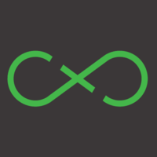

# Courses List v1.1.0

| Content | Course | Folder | Certificate  | Date | Length |
| :-----: |:------:| :-----:| :----------: | :--: | :----: |
|  | [Curso JavaScript: Programando na linguagem da web](https://cursos.alura.com.br/course/javascript-programando-na-linguagem-web) |[Source](src/Courses/JavaScript/Alura-Introducao/) | :sob: | Apr 17, 2018 | 20h |
|  | [Javascript Essentials](https://www.udemy.com/javascript-essentials/) |[Source](src/Courses/JavaScript/Udemy-Intro/Introduction) | [:bowtie:](https://www.udemy.com/certificate/UC-LM58KMEQ/) | Apr 19, 2018 | 06:29h |
|  | [Instalação e Configuração do Pentaho CE](https://www.udemy.com/instalacao-configuracao-pentaho/) |[Source](src/Courses/DevOps/VMs/Pentaho/) | [:bowtie:](https://www.udemy.com/certificate/UC-NM4A012U/) | Apr 20, 2018 | 01:00h |
|  | [Build a Twitter Clone](https://www.udemy.com/draft/608724/) |[Source](src/Courses/React/chirper/) | [:bowtie:](https://www.udemy.com/certificate/UC-JFENKTXP/) | Apr 26, 2018 | 04:00h |
|  | [AngularJS For Beginners](https://www.udemy.com/angularjs-for-beginners-udemy) |[Source](src/Courses/Angular/Beginners/) | :sob: | May 10, 2018 | 02:45h |
|   | [Docker and Containers: The Essentials](https://www.udemy.com/docker-and-containers-the-essentials) | [Source](src/Courses/Docker/Nginx/) | [:bowtie:](https://www.udemy.com/certificate/UC-Q8IN5RO7/) | Nov 28, 2018 | 01:00h |